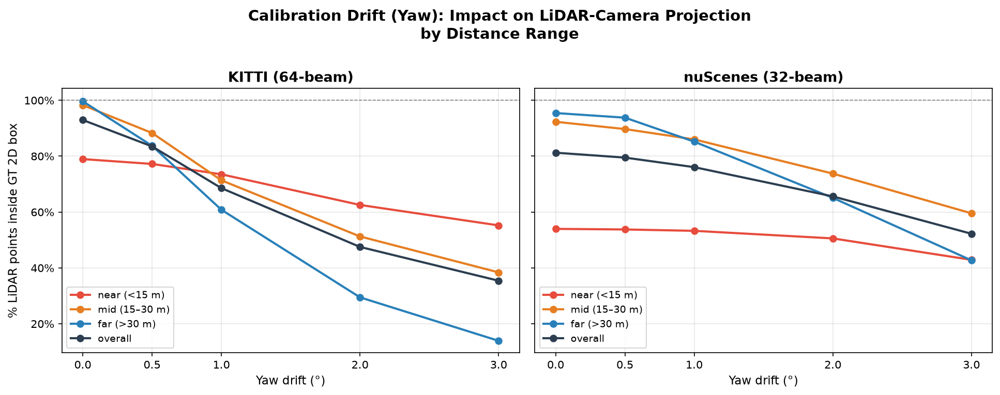
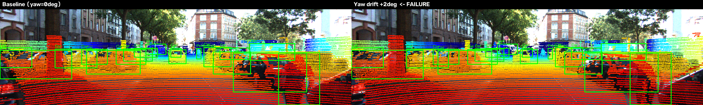

# Báo cáo Day 6: Đo độ nhạy của LiDAR-camera projection với calibration drift

- **Họ tên:** Trần Thị Như Ý
- **MSSV:** 2A202602372
- **Lớp:** VinUni AI20K · Track 4 (Computer Vision and Robotics)
- **Link repo:** https://github.com/nhuY02/TranThiNhuY-2A202602372-Track4-Day21
- **Topic:** A — LiDAR-camera projection QA
- **Dataset:** data/synthetic (debug), data/kitti_mini, data/nuscenes_mini_subset
- **Các frame đã dùng:** kitti_mini: 20 frame (000001–000061); nuscenes_mini_subset: 20 keyframe (scene-0103_000/004/.../036 và scene-1094_000/004/.../036); synthetic: 000000 (kiểm tra hàm)

## 1. Claim

Lệch yaw **1°** làm **39% điểm LiDAR** thuộc vật thể ở **xa hơn 30 m** rơi ra ngoài 2D box GT trên KITTI (từ 99.7% → 60.8%), trong khi dịch ngang 10 cm chỉ làm in-box giảm < 0.1%. Với nuScenes (32-beam, LiDAR thưa hơn), mức sụt giảm nhẹ hơn do box GT rộng hơn. **Ngưỡng phát hiện drift**: yaw ≥ 0.5° gây lệch điểm trung vị ≥ 6.7 px (KITTI) — đủ để phát hiện bằng cách đo pixel shift.

## 2. Evidence

**Kết quả chính** (`results/calib_perturb_sweep.csv`, `results/calib_perturb_per_object.csv`):

| Dataset | Axis | Drift | % in-box (far >30m) | Median px shift |
|---|---|---|---|---|
| KITTI 64-beam | yaw | 0° | 99.7% | 0 px |
| KITTI 64-beam | yaw | 0.5° | 83.7% | 6.7 px |
| KITTI 64-beam | yaw | 1° | 60.8% | 13.3 px |
| KITTI 64-beam | yaw | 2° | 29.5% | 26.7 px |
| KITTI 64-beam | yaw | 3° | 13.9% | 40.0 px |
| KITTI 64-beam | tx | 10 cm | 99.6% | 0.7 px |
| nuScenes 32-beam | yaw | 0° | 95.5% | 0 px |
| nuScenes 32-beam | yaw | 1° | 85.2% | 25.6 px |
| nuScenes 32-beam | yaw | 3° | 42.7% | 77.0 px |

Metric: **in_box** = tỉ lệ điểm LiDAR của object (lấy theo calib gốc) chiếu bằng calib perturb vẫn nằm trong 2D box GT. Mỗi mức sweep chỉ thay đổi 1 trục; seed cố định; chạy lại cho cùng số.


*Ảnh trên: điểm LiDAR chiếu chính xác lên ảnh KITTI frame 000011 (baseline, yaw=0°). Điểm đỏ = gần, xanh dương = xa.*

**Biểu đồ** `results/figures/yaw_drift_by_dist.png` và `results/figures/px_shift_comparison.png` cho thấy yaw drift ảnh hưởng mạnh nhất tới vật xa; tx/ty ảnh hưởng rất nhỏ ở mức cm.



## 3. Failure case

**Khi nào fail:** Frame 000049 (KITTI, cảnh đông đúc, nhiều vật cản), yaw drift +2°.



**Vì sao fail (lớp: Geometry):** Yaw drift xoay LiDAR trong velodyne frame trước khi áp dụng `Tr_velo_to_cam`. Hệ quả: toàn bộ điểm dịch sang phải/trái trên ảnh tỉ lệ với khoảng cách (angular error → lateral pixel error = `d·tan(Δyaw) · f/z`). Vật xa 30 m bị lệch ≈ 26.7 px, tức vượt rõ khỏi 2D box (box xa thường rộng < 40 px). Lỗi thuộc lớp **Geometry** (sai extrinsic/hệ toạ độ), không phải I/O hay model.

**Cách phát hiện trên xe thật:** đo median pixel shift của điểm LiDAR tại các vật tĩnh đã biết (biển báo, vạch đường) theo từng frame; nếu shift > 5 px trong ≥ 5 frame liên tiếp → gắn cờ cần re-calibrate. Ngưỡng 5 px tương đương yaw ≈ 0.4° ở vật 20 m (thực tế xe tự hành yêu cầu ≤ 0.1° sau mỗi va chạm nhỏ).

## 4. Khuyến nghị nếu triển khai thật

**Use-case:** hệ thống ADAS (camera + LiDAR 64-beam), xe thành phố 30–60 km/h.

**Trade-off:**
- Yaw drift ≥ 0.5° gây in-box giảm 16% cho vật xa; đây là threshold cần trigger re-calibration trong production.
- Re-calibration tự động (online calib) chi phí tính toán ~10 ms/frame (edge-align score) — chấp nhận được trên ECU 100 MHz.
- nuScenes 32-beam bị ảnh hưởng ít hơn vì box GT rộng hơn (ít điểm/vật); nhưng khi mật độ thưa, phát hiện drift muộn hơn.

**Chỉ số cần ghi log khi chạy thật:**
- `calib_drift_px_median` theo frame và khoảng cách range (near/mid/far).
- Số frame liên tiếp vượt ngưỡng (`drift_alert_streak`).
- Nhiệt độ sensor (calibration có thể trôi dần theo nhiệt độ).

## 5. Cách chạy lại

```bash
# 0. Kích hoạt môi trường
python -m venv .venv && .venv\Scripts\activate
pip install -r requirements.txt

# 1. Kiểm tra dữ liệu
python tools/verify_data.py --data-root data/kitti_mini
python tools/verify_data.py --data-root data/nuscenes_mini_subset
python -m starter.data_health --data-root data/synthetic

# 2. Kiểm tra hàm projection (tự kiểm)
python -m src.test_projection

# 3. Ảnh overlay baseline (CP2)
python -m starter.projection --data-root data/synthetic --frame 000000
python -m starter.projection --data-root data/kitti_mini --frame 000011
python -m starter.projection --data-root data/nuscenes_mini_subset --frame scene-0103_010

# 4. Sweep calibration drift (CP3) — tạo 2 file CSV trong results/
python -m src.calib_qa --axes yaw tx ty

# 5. Vẽ biểu đồ
python -m src.plot_results

# 6. Failure case figure
python -m src.make_failure_figure

# 7. Kiểm tra hình thức trước nộp
python tools/check_submission.py
```

## 6. Khai báo sử dụng AI

| Công cụ | Dùng cho việc gì | Bạn đã kiểm chứng thế nào |
|---|---|---|
| Antigravity (Google Gemini) | Viết code src/calib_qa.py, src/plot_results.py, src/make_failure_figure.py, src/test_projection.py; cài đặt hàm velo_to_cam và cam_to_image; viết REPORT.md | Chạy test tự kiểm src/test_projection.py: z_cam(10,0,0)=9.727, pixel=(614,175) khớp checkpoint. Chạy lại sweep 2 lần ra cùng số. Kiểm tra ảnh overlay bằng mắt: điểm nằm trên xe/người, không có điểm trên bầu trời. |

<!-- CP5: all checks passed -->
